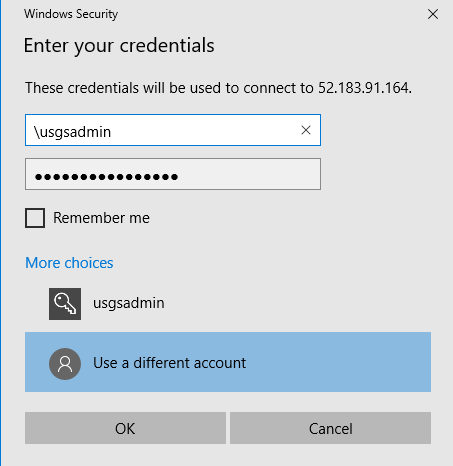
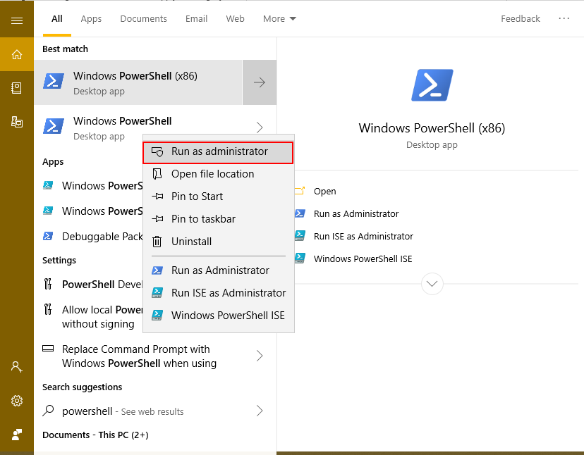
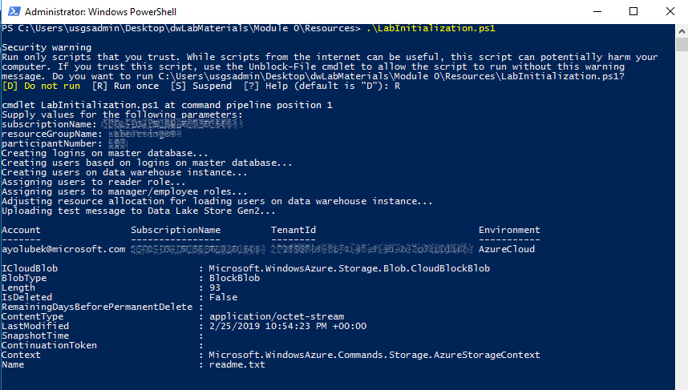

# Module 0: Install Lab Pre-requisites

## Overview

In this module, you will initialize your SQL Data Warehouse with SQL users and logins and restore the sample fire events database you will be working with in later modules.

## Pre-requisites:

Please refer to &quot;BeforeLab&quot; module to create the VM and all other services needed. The services include Azure Data Factory, Azure Data Lake Storage, Azure Databricks and Azure Synapse etc.

## Login to Azure VM

The provisioned Azure VM comes pre-installed with the client tools you will need to complete lab modules: Azure PowerShell, SQL Server Management Studio (SSMS), Azure Storage Explorer, SQL Server, Azure Data Factory on-prem runtime instance. To login using a Remote Desktop Session, use the credentials below -making sure to replace &#39;##&#39; with the userNumber you used for deployment:

- VM Username: \usgsadmin
- VM Password: usgsP@ssword##

  

## Disable PowerShell strict checking

After login, you will disable strict checking of PowerShell scripts to allow you to run the scripts included with lab modules.

1. Open a PowerShell session as administrator

  

2. Run the following command to disable strict checking for PowerShell scripts
    ```powershell
    Set-ExecutionPolicy Unrestricted -Force
    ```

## Restore on-prem database to local SQL Server

In this section, you will restore the fireEvents database to the SQL Server instance running inside your Azure VM. This might have already been done as part of initial deployment.

1. Clone the repositry using Git

    ```powershell
    git clone https://github.com/wangyihaier/AzureMDWScripts
    ```

2. Open a new PowerShell session and run the lab bootstrap script:
Module 0\Resources\USGS\_LabBootstrap.ps1 script.


## Initialize SQL Data Warehouse with users

In this section, you will initialize your SQL Data Warehouse with the logins you will use for the loading, query, and security modules.

1. In the open PowerShell session, run the Initialization script:
Module 0\Resources\LabInitialization.ps1

2. Fill in your participant number, subscription name for deployment, and resource group when prompted.

  