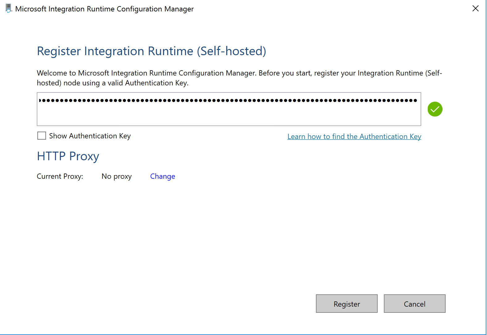
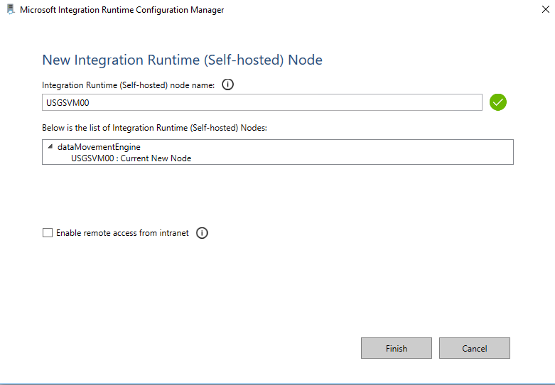
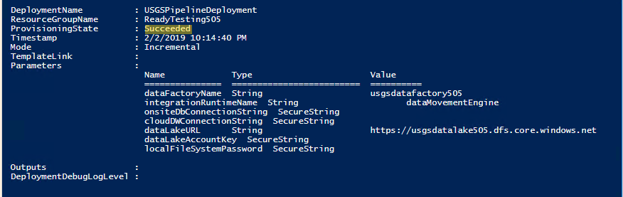
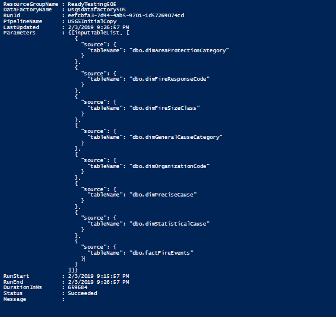
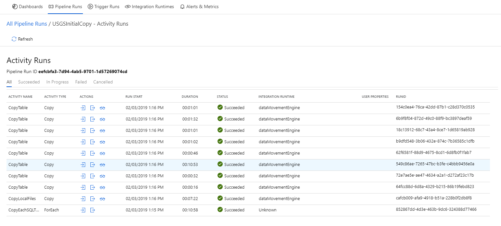
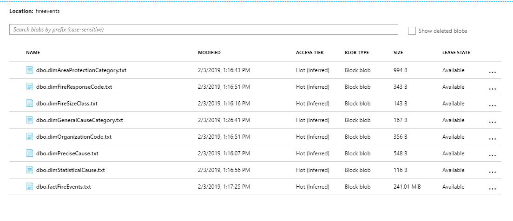
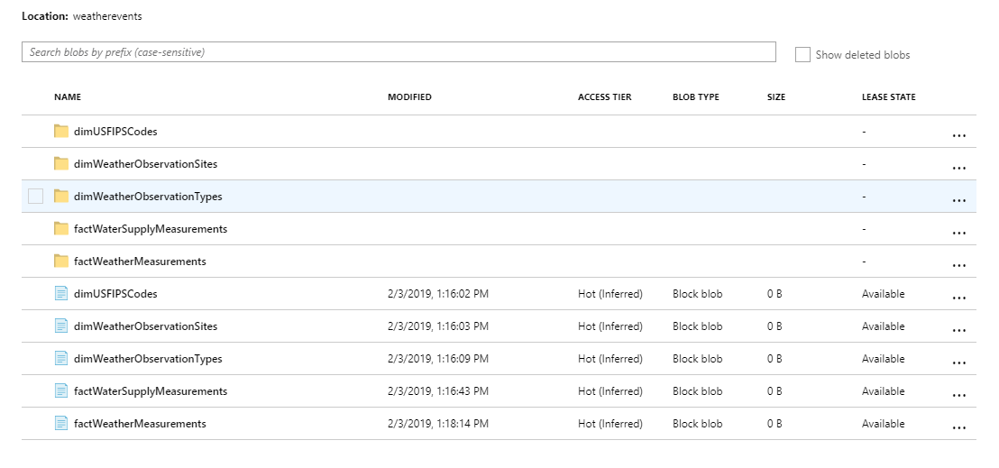

# Module 1: Land raw data in Azure Data Lake Store (Gen2)

## Overview

In this module, you learn how to copy data from on-prem sources to Azure. You will use Azure Data Factory to create a pipeline that copies CSV data and data from an on-prem SQL Server instance to Azure Data Lake Store Gen2.

## Pre-requisites:

- Existing Azure Data Lake Gen2 Storage account
- Existing Azure Data Factory
- Completed pre-requisites from Module 0

## Login to your Azure subscription in PowerShell

The rest of this module will use PowerShell to configure settings and values. Run the following to setup your PowerShell session.
```powershell
# ------- Edit the variables below to set session-wide variables ---------

$subscriptionId = '<SubscriptionId>'
$participantNumber = '<participantNumber>'
$resourceGroupName='<resourceGroupName>'

# Log into your Azure account
Connect-AzAccount -Subscription $subscriptionId

```
Run the following to setup the variables you’ll use to configure Azure PowerShell commands in the lab:

```powershell
# ------- Setup module variables -------------------------- 
$serverName = 'usgsserver' + $participantNumber
$fullyQualifiedServerName = $serverName + '.database.windows.net'
$dataWarehouseName = 'usgsdataset'
$dataFactoryName = 'usgsdatafactory' + $participantNumber
$dataLakeName = 'usgsdatalake' + $participantNumber
$adminUser = 'usgsadmin'
$adminPassword = 'P@ssword' + $participantNumber   

```

## Configure self-hosted integration runtime instance

In this section, you will configure an Azure Data Factory self-hosted Integration Runtime instance. The Integration Runtime (IR) is the compute infrastructure used by Azure Data Factory to perform scalable and performant data transfer from on-premises locations to Azure.

**In your existing PowerShell session**

1. Create an integration runtime instance in the existing data factory
```powershell
# Create an integration runtime instance
Set-AzDataFactoryV2IntegrationRuntime -ResourceGroupName $resourceGroupName -DataFactoryName $dataFactoryName -Name 'dataMovementEngine' -Type SelfHosted 
-Description "Integration runtime to copy on-prem SQL Server data to cloud" 
```
2. Retrieve the Integration Runtime key for the instance you just created. The command will display two IR keys (AuthKey1 and AuthKey2). Copy and paste AuthKey1 into a notepad window. 
```powershell
# Retrieve integration runtime instance key
Get-AzDataFactoryV2IntegrationRuntimeKey -ResourceGroupName $resourceGroupName -DataFactoryName $dataFactoryName -Name dataMovementEngine
```
3.	Open the Microsoft Integration Runtime Configuration Manager on your computer. Paste the IR Key into the registration window and click ‘Register’. 

    

4.	In the next configuration window, verify that the integration runtime name is in the format USGSVM## - where ‘##’ represents your number from deployment. 

    

5.	Click ‘Finish’ on the configuration window -you should see a successful registration window as shown below. Close the window and continue onto the next step.

    


## Copy data from on-prem system to Azure Data Lake Storage

In this section, you will copy two sets of data from your machine to Azure Data Lake Storage. The first dataset is fire event data stored on a SQL Server instance. The second dataset is weather event data stored on a local folder in Windows. You will use the integration runtime setup in the previous section to orchestrate the copy. 

**In your existing PowerShell session**

In this section, you will copy two sets of data from your machine to Azure Data Lake Storage. The first dataset is fire event data stored on a SQL Server instance. The second dataset is weather event data stored on a local folder in Windows. You will use the integration runtime setup in the previous section to orchestrate the copy

1. You will use an Azure Resource Manager (ARM) template to create the pipeline that copies data. To successfully deploy this template, you will need to configure a few parameters that will be used to refer to your deployed Azure resources. Type the following in your PowerShell window to configure the variables that will be used as parameters for the deployment.  **Make sure to replace ‘##’ with your participant number:**

    ```powershell
    $localUserPassword = "usgsP@ssword" + $participantNumber   
    $localUserId = "usgsadmin"

    $integrationRuntimeName = 'dataMovementEngine'
    $dWConnectionString = "Server=tcp:$fullyQualifiedServerName,1433;Initial Catalog=$dataWarehouseName;User ID=$adminuser;Password=$adminPassword;Encrypt=True;TrustServerCertificate=False;Connection Timeout=30;"
    $dwConnectionString_Secure = ConvertTo-SecureString -String $dwConnectionString -AsPlainText -Force
    $localUserPassword_Secure = ConvertTo-SecureString -String $localUserPassword -AsPlainText -Force
    $dataLakeAccountKey = (Get-AzStorageAccountKey -ResourceGroupName $resourceGroupName -Name $dataLakeName).Value[0] 
    $dataLakeAccountKey_Secure = ConvertTo-SecureString -String $dataLakeAccountKey -AsPlainText -Force
    $dataLakeURL = "https://$dataLakeName.dfs.core.windows.net"  

    ```
2.	Create a new data factory pipeline called ‘USGSInitialCopy’. 
    ```powershell
    # Create a data factory pipeline to copy from on-prem to ADLS Gen2
    New-AzResourceGroupDeployment -Name USGSPipelineDeployment -ResourceGroupName $resourceGroupName -TemplateFile "C:\USGSdata\loadingtemplates\usgs_copypipeline_v2.0.json" -dataFactoryName $dataFactoryName -integrationRuntimeName $integrationRuntimeName -cloudDWConnectionString $dwConnectionString_Secure -dataLakeURL $dataLakeURL -dataLakeAccountKey $dataLakeAccountKey_Secure -localFileSystemPassword $localUserPassword_Secure -localUserId $localUserId -localServerName $env:computername

    ```
3.	Ensure the deployment to data factory completes successfully (as shown below):

    

4.	Manually trigger the pipeline to start the data copy. 
    ```powershell
    # Manually trigger pipeline
    $pipelineRunId = Invoke-AzDataFactoryV2Pipeline -ResourceGroupName $resourceGroupName -DataFactoryName $dataFactoryName -PipelineName "USGSInitialCopy" 
    ```
5.	You can monitor the status of the copy operation by running the command Get-AzDataFactoryV2PipelineRun. You can also monitor the status visually by logging into the Azure portal, navigating to your Azure Data Factory instance and viewing running pipelines.

    Monitor the progress of the pipeline until the copy activity is completed. 
      ```powershell
    # Monitor pipeline status
    Get-AzDataFactoryV2PipelineRun -ResourceGroupName $resourceGroupName -DataFactoryName $dataFactoryName -PipelineRunId $pipelineRunId 
    ```

    

    

6.  Once done, launch the [Azure portal](http://portal.azure.com/) and navigate to your Data Lake Storage Account. In there, you should see blob containers ‘fireEvents’, and ‘weatherEvents’ with all the data copied via the pipeline.

    

     
