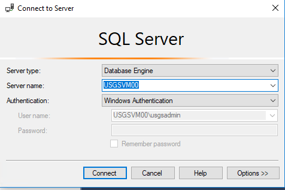
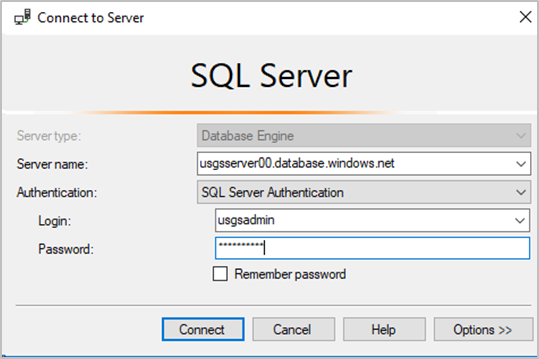
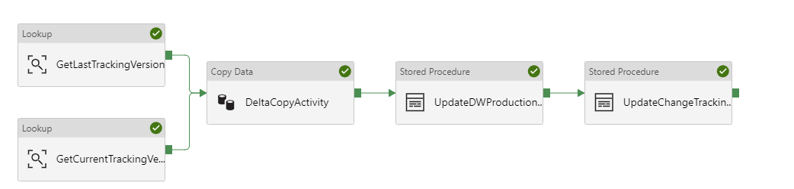
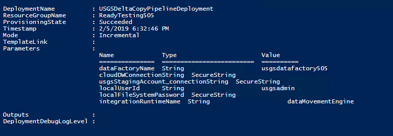
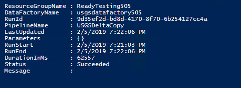
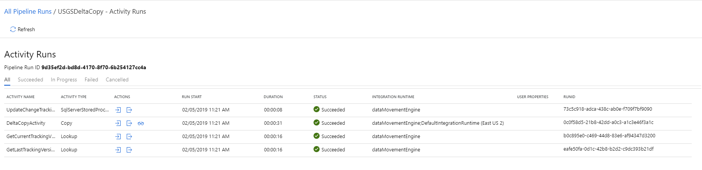

# Module 3: SQL Data Warehouse Ingestion

## Overview 

In this module, you will learn about the different methods you can use to load data into your SQL Data Warehouse.  First, you’ll use Polybase to query external data in Azure Data Lake Store Gen2. Then, you’ll use the ‘CREATE TABLE AS SELECT’ (CTAS) statement to load this external data into internal SQL DW tables. You’ll also explore loading best practices, including the use of staging tables for max loading performance. 

## Pre-requisites:

- Existing Azure SQL Data Warehouse
- Existing Azure Data Lake Storage (Gen2) instanc¬¬e
- Existing Azure virtual network
- Azure subscription

If you haven’t run through the earlier modules in the series, launch PowerShell and run the Module3Init.ps1 PowerShell script in the **Module 3\Resources** folder. This will configure your data warehouse and virtual network with the pre-requisites needed to complete this lab.

## Connect to your SQL Data Warehouse

Before you start loading data into your data warehouse, there’s a few best practices to follow.  First, create a separate user with higher resource allocation for loading jobs.  This gives you greater control over security and workload management by separating loading jobs from analytical queries. You can assign more data warehouse resources to the loading user to ensure ETL jobs have the critical resources needed to ingest data. 

For the purposes of this lab, the loading user has already been pre-created for you with a staticrc60 resource class. 

**In SQL Server Management Studio (SSMS):**
1.	Launch the Object Explorer and connect with the credentials provided below – making sure to replace ‘## with your participant number:
    * **Server name:** usgsserver##.database.windows.net
    * **Authentication:** SQL Server Authentication
    * **Username:** usgsloader
    * **Password:** P@ssword##

    

## Create a staging schema

When loading into SQL Data Warehouse, it is best practice to initially load into staging tables. These staging tables should be round robin distributed with no indices to maximize loading performance.  While there are many different strategies for creating staging tables, the simplest strategy is to create a new staging schema.  In the next module, you’ll learn how to optimize this data for querying by using distributed tables and columnstore indices. 

**In SQL Server Management Studio:**

1.	Create a master key if one does not already exist. This protects any private keys, and only needs to be done once per data warehouse. 
    ```sql 
    IF NOT EXISTS(SELECT * FROM sys.symmetric_keys WHERE NAME LIKE '%DatabaseMasterKey%') CREATE MASTER KEY;

    ```

2.	Create an external data source.  This defines the connection with your external data source – in this case, Azure Data Lake Gen 2.  In this definition, we’re leveraging the fact that the Azure SQL Data Warehouse can authenticate directly to the Azure Data Lake with managed service identity authentication.

    In the commands below, replace ‘##’ with your participant number:

    ```sql 

        CREATE DATABASE SCOPED CREDENTIAL msi_cred
        WITH IDENTITY = 'Managed Service Identity';
        GO
        
        CREATE EXTERNAL DATA SOURCE USGSWeatherEvents
        WITH 
        (
            TYPE = HADOOP
            ,LOCATION = 'abfss://weatherevents@usgsdatalake##.dfs.core.windows.net'
            ,CREDENTIAL = msi_cred
        );

        CREATE EXTERNAL DATA SOURCE USGSFireEvents
        WITH 
        (
            TYPE = HADOOP
            ,LOCATION = 'abfss://fireevents@usgsdatalake##.dfs.core.windows.net'
            ,CREDENTIAL = msi_cred
        );
        
    ```

3.	Create an external file format defining properties of the CSV files you’ll load.

    ```sql 
    CREATE EXTERNAL FILE FORMAT TextFileFormat 
    WITH 
    (   
        FORMAT_TYPE = DELIMITEDTEXT,
        FORMAT_OPTIONS
        (   
            FIELD_TERMINATOR = '|'
        )
    );

    ```

4.	Create external tables.  Once created, you can view them in the ‘External Tables’ subsection in SSMS’s Object Explorer, and issue queries directly on these table.

    ```sql 
    --Create External Table
    --WeatherData

    --factWeatherMeasurements
    CREATE EXTERNAL TABLE [EXT].[factWeatherMeasurements]
    (
        [StationId] [nvarchar](12) NOT NULL,
        [ObservationTypeCode] [nvarchar](4) NOT NULL,
        [ObservationValueCorrected] [real] NOT NULL,
    [ObservationValue] [real] NOT NULL,
        [ObservationDate] [date] NOT NULL,
        [ObservationSourceFlag] [nvarchar](2) NULL,
        [fipscountycode] [varchar](5) NULL
    )
    WITH
    (
        DATA_SOURCE = USGSWeatherEvents,
        LOCATION = '/factWeatherMeasurements/',
        FILE_FORMAT = TextFileFormat
    );

    --dimWeatherObservationTypes
    CREATE EXTERNAL TABLE [EXT].[dimWeatherObservationTypes]
    (
        [ObservationTypeCode] [nvarchar](5) NOT NULL,
        [ObservationTypeName] [nvarchar](100) NOT NULL,
        [ObservationUnits] [nvarchar](5) NULL
    )
    WITH
    (
        DATA_SOURCE = USGSWeatherEvents,
        LOCATION = '/dimWeatherObservationTypes/',
        FILE_FORMAT = TextFileFormat
    );

    --dimUSFIPSCodes
    CREATE EXTERNAL TABLE [EXT].[dimUSFIPSCodes]
    (
        [FIPSCode] [varchar](5) NOT NULL,
        [StateFIPSCode] [smallint] NOT NULL,
        [CountyFIPSCode] [smallint] NOT NULL,
        [StatePostalCode] [varchar](2) NOT NULL,
        [CountyName] [varchar](35) NOT NULL,
        [StateName] [varchar](30) NOT NULL
    )
    WITH
    (
        DATA_SOURCE = USGSWeatherEvents,
        LOCATION = '/dimUSFIPSCodes/',
        FILE_FORMAT = TextFileFormat
    );

    --dimWeatherObservationSites
    CREATE EXTERNAL TABLE [EXT].[dimWeatherObservationSites]
    (
        [StationId] [nvarchar](20) NOT NULL,
        [SourceAgency] [nvarchar](10) NOT NULL,
        [StationName] [nvarchar](150) NULL,
        [CountryCode] [varchar](2) NULL,
        [CountryName] [nvarchar](150) NULL,
        [StatePostalCode] [varchar](3) NULL,
        [FIPSCountyCode] [varchar](5) NULL,
        [StationLatitude] [decimal](11, 8) NULL,
        [StationLongitude] [decimal](11, 8) NULL,
        [NWSRegion] [nvarchar](30) NULL,
        [NWSWeatherForecastOffice] [nvarchar](20) NULL,
        [GroundElevation_Ft] [real] NULL,
        [UTCOffset] [nvarchar](10) NULL
    )
    WITH
    (
        DATA_SOURCE = USGSWeatherEvents,
        LOCATION = '/dimWeatherObservationSites/',
        FILE_FORMAT = TextFileFormat
    );

    /*----fireevents----*/

    --dimOrganizationCode
    CREATE EXTERNAL TABLE [EXT].[dimOrganizationCode](
        [OrganizationCode] [nvarchar](5) NOT NULL,
        [OrganizationName] [nvarchar](100) NULL
    )
    WITH
    (
        DATA_SOURCE = USGSFireEvents,
        LOCATION = '/dbo.dimOrganizationCode.txt',
        FILE_FORMAT = TextFileFormat
    );

    --dimAreaProtectionCategory
    CREATE EXTERNAL TABLE [EXT].[dimAreaProtectionCategory]
    (
        [ProtectionCategoryCode] [nvarchar](2) NOT NULL,
        [ProtectionCategoryDescription] [nvarchar](150) NOT NULL
    )
    WITH
    (
        DATA_SOURCE = USGSFireEvents,
        LOCATION = '/dbo.dimAreaProtectionCategory.txt',
        FILE_FORMAT = TextFileFormat
    );

    --factFireEvents
    CREATE EXTERNAL TABLE [EXT].[factFireEvents](
        [ObjectId] [int] NOT NULL,
        [OrganizationCode] [nvarchar](5) NOT NULL,
        [ReportingFireUnit] [varchar](5) NOT NULL,
        [ReportingFireSubUnitId] [nvarchar](10) NOT NULL,
        [ReportingFireSubUnitName] [nvarchar](100) NOT NULL,
        [FireId] [varchar](15) NOT NULL,
        [FireName] [nvarchar](55) NOT NULL,
        [USFSFireNumber] [varchar](20) NOT NULL,
        [FireIncidentCode] [varchar](10) NOT NULL,
        [HumanOrNaturalCause] [nvarchar](15) NOT NULL,
        [PreciseCauseCode] [int] NOT NULL,
        [StatisticalCauseCode] [int] NOT NULL,
        [FireSizeClassCode] [nvarchar](5) NOT NULL,
        [FireSizeClassNumber] [int] NOT NULL,
        [FireResponseCode] [int] NOT NULL,
        [AreaProtectionCategoryCode] [nvarchar](2) NOT NULL,
        [FireManagementResponseCode] [nvarchar](2) NOT NULL,
        [YearString] [varchar](5) NOT NULL,
        [FiscalYear] [int] NOT NULL,
        [FireDiscoveryTime] [datetime2](7) NULL,
        [FireSupressTime] [datetime2](7) NULL,
        [FireExtinguishTime] [datetime2](7) NULL,
        [GeographicAreaCoordinationCenter] [varchar](5) NOT NULL,
        [DispatchCenterName] [nvarchar](60) NOT NULL,
        [StateName] [nvarchar](25) NOT NULL,
        [StateFipsCode] [varchar](2) NOT NULL,
        [FipsInt] [int] NOT NULL,
        [FireLatitude] [varchar](20) NULL,
        [FireLongitude] [varchar](20) NULL,
        [TotalAcres] [float] NOT NULL,
        [GeneralCauseCategoryCode] [int] NOT NULL,
        [PreciseCauseCategoryCode] [int] NOT NULL,
        [Duration_Days] [int] NULL,
        [FireLongitudeDetail] [varchar](20) NULL,
        [FireLatitudeDetail] [varchar](20) NULL
    )
    WITH
    (
        DATA_SOURCE = USGSFireEvents,
        LOCATION = '/dbo.factFireEvents.txt',
        FILE_FORMAT = TextFileFormat
    );
    ```

5.	Run the following sample queries and any others you can think of to explore the external dataset. Take note of the response times for servicing these queries.

    ```sql 
    -- Yearly temperature averages and precipitation per county for years 2004 - 2019
    SELECT	fipsCode,
        CountyName,
    StatePostalCode,
        Year(ObservationDate) AS MeasurementYear,
        AVG(CASE ObservationTypeCode WHEN 'TAVG' THEN ObservationValueCorrected END) AS AvgTemperature_degCelsius,
        AVG(CASE ObservationTypeCode WHEN 'TMIN' THEN ObservationValueCorrected END) AS AvgMinTemperature_degCelsius,
        AVG(CASE ObservationTypeCode WHEN 'TMAX' THEN ObservationValueCorrected END) AS AvgMaxTemperature_degCelsius,
        AVG(CASE ObservationTypeCode WHEN 'PRCP' THEN ObservationValueCorrected END) AS AvgPrecipitation_mm
    FROM	ext.factWeatherMeasurements weather
    JOIN	ext.dimusfipscodes fips on weather.fipscountycode = fips.fipscode
    WHERE	Year(ObservationDate) > 2004 AND Year(ObservationDate) < 2019
    GROUP	BY fipscode, CountyName, StatePostalCode, Year(ObservationDate)
    ORDER	BY StatePostalCode, MeasurementYear

    -- Count of fires by state
    SELECT	StateName,
        COUNT(DISTINCT FireId) AS FireOccurences,
        AVG(TotalAcres) AS AvgAcresBurned
    FROM	ext.FactFireEvents
    GROUP	BY StateName
    ORDER	BY StateName

    ```

## Load external data with CTAS statements

Polybase also allows you to load data from your data lake using Create-Table-As-Select (CTAS) statements.  CTAS statements let you create a table using a select statement – in this case, you’ll select all the columns from the external tables and create a new table within your data warehouse, loading it directly into your SQL Data Warehouse.  This method allows you to perform inflight data transformations, and makes use of Polybase’s parallelization capabilities for optimal loading performance. 
The following script contains CTAS statements for each external table, loading into a round-robin table in your data warehouse.  Note that these tables are part of the staging schema [STG] – in a future step, you’ll perform another CTAS statement to create production tables optimized for lightning fast-analytics.  

**In SQL Server Management Studio:**

1.	Run the following script.  This creates new staging tables in the [STG] schema by selecting from the external tables.  Notice how all these tables are round-robin distributed – this ensures optimal load speed.  We’ll cover how to distribute these tables optimally in the next module.  You’ll also notice that the loading statements have labels associated with them – this is useful for monitoring the progress of the loads.

    ```sql
    /*-- CTAS External Tables into Staging Tables --*/
    --Weather Data
    --factWeatherMeasurements
    CREATE TABLE [STG].[factWeatherMeasurements]
    WITH
    (
        CLUSTERED COLUMNSTORE INDEX,
        DISTRIBUTION = ROUND_ROBIN
    )
    AS SELECT * FROM [EXT].[factWeatherMeasurements] OPTION(label = 'load_weatherfact');

    --dimWeatherObservationTypes
    CREATE TABLE [STG].[dimWeatherObservationTypes]
    WITH
    (
        CLUSTERED COLUMNSTORE INDEX,
        DISTRIBUTION = ROUND_ROBIN
    )
    AS SELECT * FROM [EXT].[dimWeatherObservationTypes] OPTION(label = 'load_weatherobservationtypes');

    --dimUSFIPSCodes
    CREATE TABLE [STG].[dimUSFIPSCodes]
    WITH
    (
        CLUSTERED COLUMNSTORE INDEX,
        DISTRIBUTION = ROUND_ROBIN
    )
    AS SELECT * FROM [EXT].[dimUSFIPSCodes] OPTION(label = 'load_fips');

    --dimWeatherObservationSites
    CREATE TABLE [STG].[dimWeatherObservationSites]
    WITH
    (
        CLUSTERED COLUMNSTORE INDEX,
        DISTRIBUTION = ROUND_ROBIN
    )
    AS SELECT * FROM [EXT].[dimWeatherObservationSites] OPTION(label = 'load_weatherobservationsites');

    /*----fireevents----*/
    --factFireEvents
    CREATE TABLE [STG].[factFireEvents]
    WITH 
    (
        CLUSTERED COLUMNSTORE INDEX,
        DISTRIBUTION = ROUND_ROBIN
    )
    AS SELECT * FROM [EXT].[factFireEvents] OPTION(label = 'load_firefact');


    ----dimOrganizationCode
    CREATE TABLE [STG].[dimOrganizationCode]
    WITH
    (
        CLUSTERED COLUMNSTORE INDEX,
        DISTRIBUTION = ROUND_ROBIN
    )
    AS SELECT * FROM [EXT].[dimOrganizationCode] OPTION(label = 'load_organizationcode');
        

    --dimAreaProtectionCategory
    CREATE TABLE [STG].[dimAreaProtectionCategory]
    WITH
    (
        CLUSTERED COLUMNSTORE INDEX,
        DISTRIBUTION = ROUND_ROBIN
    )
    AS SELECT * FROM [EXT].[dimAreaProtectionCategory] OPTION(label = 'load_protectioncategory');

    ```

## Monitoring loading jobs

You can track the progress of your data load using DMVs directly in SQL Data Warehouse.  By filtering the DMV ‘sys.dm_pdw_exec_requests’ on the query label we added to our CTAS statements, you can keep track all your loading jobs easily, even on a busy data warehouse.

**In SQL Server Management Studio:**

1.	Run the following script in a new SSMS query window to view your loading jobs.

    ```sql
    SELECT	r.* 
    FROM	sys.dm_pdw_exec_requests r 
    WHERE	r.[label] LIKE 'load_%';

    ```

2.	When all the tables have been loaded, you can rerun the sample queries from before but this time targeting the tables with data loaded into SQL DW. Take note of the decrease in response times for servicing the exact same queries.

    ```sql
    -- Yearly temperature averages and precipitation per county for years 2004 - 2019
    SELECT	fipsCode,
        CountyName,
    StatePostalCode,
        Year(ObservationDate) AS MeasurementYear,
        AVG(CASE ObservationTypeCode WHEN 'TAVG' THEN ObservationValueCorrected END) AS AvgTemperature_degCelsius,
        AVG(CASE ObservationTypeCode WHEN 'TMIN' THEN ObservationValueCorrected END) AS AvgMinTemperature_degCelsius,
        AVG(CASE ObservationTypeCode WHEN 'TMAX' THEN ObservationValueCorrected END) AS AvgMaxTemperature_degCelsius,
        AVG(CASE ObservationTypeCode WHEN 'PRCP' THEN ObservationValueCorrected END) AS AvgPrecipitation_mm
    FROM	stg.factWeatherMeasurements weather
    JOIN	stg.dimusfipscodes fips on weather.fipscountycode = fips.fipscode
    WHERE	Year(ObservationDate) > 2004 AND Year(ObservationDate) < 2019
    GROUP	BY fipscode, CountyName, StatePostalCode, Year(ObservationDate)
    ORDER	BY StatePostalCode, MeasurementYear

    -- Count of fires by state
    SELECT	StateName,
        COUNT(DISTINCT FireId) AS FireOccurences,
        AVG(TotalAcres) AS AvgAcresBurned
    FROM	stg.FactFireEvents
    GROUP	BY StateName
    ORDER	BY StateName

    ```

## Incremental Load with Azure Data Factory

Loading data into your data-warehouse is a continuous never-ending process. A best-practice data warehouse loading pattern is the use of ‘delta loads’ where only new or updated data is ingested into the data warehouse. Azure Data Factory provides a copy activity which you can leverage to implement this pattern. This allows you to operationalize loading jobs and integrate them with other tasks in your ETL pipelines.

In this section, you will use SQL Server’s change tracking feature to identify new or updated data since the last read. Then, you will create a Data Factory pipeline that uses the change tracking feature and Azure Data Factory’s copy activity to load data deltas directly into SQL Data Warehouse.

**Enable change-tracking on the on-prem SQL database:**

1.	Login to the SQL Server on your client machine using the following credentials - **making sure to replace ‘##’ with your participant Id:**
* **Server name:** usgsvm##
* **Authentication:** Windows Authentication

    

2.	Right-click on the ‘fireevents’ database, select ‘New Query’. Run the following queries to enable change tracking on the database and ‘factFireEvents’ table:

    ```sql
    -- Turn on change tracking feature on database
    ALTER DATABASE fireevents
    SET CHANGE_TRACKING = ON  
    (CHANGE_RETENTION = 2 DAYS, AUTO_CLEANUP = ON) 

    -- Add primary key to factFireEvents table
    ALTER TABLE dbo.factFireEvents
    ADD CONSTRAINT PK_factFireEvents_ObjectId PRIMARY KEY CLUSTERED(ObjectId) 

    --Enable change tracking on factFireEvents table
    ALTER TABLE dbo.factFireEvents
    ENABLE CHANGE_TRACKING  
    WITH (TRACK_COLUMNS_UPDATED = ON)

    ```

3.	Create a table to store the last change tracking version that was read.

    ```sql
    -- Create change tracking table
    CREATE TABLE dbo.changeTrackingRecords
    (
        TableName VARCHAR(255),
        SYS_CHANGE_VERSION BIGINT,
    );

    -- Initialize change tracking table with current value
    DECLARE @currentVersion BIGINT = CHANGE_TRACKING_CURRENT_VERSION();  

    INSERT INTO dbo.changeTrackingRecords
    VALUES ('factFireEvents', @currentVersion)

    ```

4.	Create a stored procedure in SQL Server that will update the change tracking version after each data factory pipeline run

    ```sql
    -- Update change tracking version after pipeline run
    CREATE PROCEDURE sp_UpdateChangeTrackingVersion @CurrentTrackingVersion BIGINT, @TableName VARCHAR(255)
    AS
    BEGIN
    UPDATE changeTrackingRecords
            SET [SYS_CHANGE_VERSION] = @CurrentTrackingVersion
        WHERE [TableName] = @TableName
    END

    ```
**Create a stored procedure to insert data into SQL Data Warehouse:**

While CTAS statements are one way to ingest data into SQL Data Warehouse, you can also leverage ‘INSERT INTO’ statements to ingest data. These statements are best used in cases when creating a new table with updated data is not appropriate, and the data updates are not in millions of rows. 
1.	Login to your Azure SQL Data Warehouse using the following credentials – **making sure to replace ## with your participant number:**

* **Server name:** usgsserver##.database.windows.net
* **Authentication:** SQL Server Authentication
* **Username:** usgsadmin
* **Password:** P@ssword##

    

2.	Create a stored procedure that will be used in the ADF pipeline to insert new records into the production tables. This stored procedure takes the ‘PipelineRunId’ from a data factory pipeline run as input parameter and appends this to the data in staging tables. This ID can then be used later for data lineage purposes. 

    ```sql
    -- Create hash-distributed fire events table. More details on this in Module 4
    CREATE TABLE [prod].[factFireEvents]
    WITH 
    (
        CLUSTERED COLUMNSTORE INDEX,
        DISTRIBUTION = HASH(StateFipsCode)
    )
    AS SELECT *, CONVERT(UNIQUEIDENTIFIER,0x0) as ELTID FROM [STG].[factFireEvents] 

    -- Adds new records to the prod.factFireEvents production table
    CREATE PROC [prod].[sp_addFireStagingRecordsToProduction] @pipelineRunId [NVARCHAR](36) AS  
    BEGIN
        INSERT INTO prod.factFireEvents
        SELECT *,CONVERT(UNIQUEIDENTIFIER,@pipelineRunId) As ELTID FROM stg.factFireEvents	
    END

    ```

## Deploy incremental load pipeline to Azure Data Factory:



In this section, you deploy an Azure Data Factory pipeline that uses SQL Server’s change tracking feature to get delta updates for the ‘factFireEvents’ table. These delta updates are copied to a staging table in SQL Data Warehouse using Azure Data Factory’s copy activity. Finally, the data is inserted into a production table in SQL Data Warehouse using the stored procedure created in the previous section. 
If you haven’t previously logged into your Azure account in PowerShell, run the following to setup your PowerShell session:

```powershell
# ------- Edit the variables below to set session-wide variables --------- 
$subscriptionName = '<SubscriptionName>' 
$participantNumber = <ParticipantNumber> 
$resourceGroupName = '<ResourceGroupName>'

# Log into your Azure account
Connect-AzAccount -Subscription $SubscriptionName

```

**In your existing PowerShell session:**

1.	You will use an Azure Resource Manager (ARM) template to create the pipeline for incremental data copy. To successfully deploy this template, you will need to configure a few parameters that will be used to refer to your Azure resources. Type the following in your PowerShell window to configure the variables that will be used as parameters for the deployment:

    ```powershell
    $serverName = 'usgsserver' + $participantNumber
    $fullyQualifiedServerName = $serverName + '.database.windows.net'
    $dataWarehouseName = 'usgsdataset'
    $adminUser = 'usgsadmin'
    $adminPassword = 'P@ssword' + $participantNumber
    $localUserPassword = "usgsP@ssword" + $participantNumber   
    $dWConnectionString = "Server=tcp:$fullyQualifiedServerName,1433;Initial Catalog=$dataWarehouseName;User ID=$adminuser;Password=$adminPassword;Encrypt=True;TrustServerCertificate=False;Connection Timeout=30;"
    $dwConnectionString_Secure = ConvertTo-SecureString -String $dwConnectionString -AsPlainText -Force
    $stagingAccountName = "usgsstaging" + $participantNumber 
    $stagingAccountKey = (Get-AzStorageAccountKey -ResourceGroupName $resourceGroupName -Name $stagingAccountName).Value[0] 
    $localUserPassword_Secure = ConvertTo-SecureString -String $localUserPassword -AsPlainText -Force
    $stagingAccountKey_Secure = ConvertTo-SecureString -String $stagingAccountKey -AsPlainText -Force
    $stagingAccountURL = "https://$stagingAccountName.blob.core.windows.net"
    $stagingAccountConnectionString = "DefaultEndpointsProtocol=https;AccountName=$stagingAccountName;AccountKey=$stagingAccountKey"
    $stagingAccountConnectionString_Secure = ConvertTo-SecureString -String $stagingAccountConnectionString -AsPlainText -Force   

    ```                                                                                                      

2.	Create a new data factory pipeline called ‘USGSDeltaCopy’.

    ```powershell
    # Create a data factory pipeline to delta from on-prem SQL to SQL DW
    New-AzResourceGroupDeployment -Name USGSDeltaCopyPipelineDeployment -ResourceGroupName $resourceGroupName -TemplateFile "C:\USGSdata\loadingtemplates\usgs_deltacopypipeline.json" -dataFactoryName $dataFactoryName -cloudDWConnectionString $dwConnectionString_Secure -USGSStagingAccount_connectionString $stagingAccountConnectionString_Secure -localServerName $env:computername -stagingAccountURL $stagingAccountURL -stagingAccountKey $stagingAccountKey_Secure -localFileSystemPassword $localUserPassword_Secure

    ```

3.	Ensure the deployment to the data factory completes successfully. Explore the pipeline in the Azure portal.
                                
    

4.	Switch to your existing SSMS session targeting the on-prem ‘fireevents’ database. Run the following query to insert new fire events data into the on-prem fireevents SQL database

```sql
--Insert new fire events into fact table
INSERT INTO factFireEvents VALUES
(844884,'FS','03','0303','Cibola National Forest','2017TXTXS001022','Kritser East',' ',' ','Human',0,0,'NR',0,0,'0','0','2017',2017,'2017-04-19','2017-04-22',NULL,'SWCC','Aalamogordo Interagency Dispatch Center','Texas','48',48,35.4817,-101.8898,1546,0,0,0,NULL,NULL),
(844885,'FWS','81672','USCABRR','Bitter Creek National Wildlife Refuge','2017CARRU053193','Opera',' ',' ','Human',0,0,'NR',0,0,'0','0','2017',2017,'2017-04-30','2017-04-30',NULL,'OSCC','Kern County Fire Department Emergency Communication Center','California','06',6,34.0056,-117.3064,1350,0,0,0,NULL,NULL),
(844886,'FWS','41510','USFLLSR','Chassahowitzka National Wildlife Refuge','2017FLFLS180096','Trail Fire',' ',' ','Human',0,0,'NR',0,0,'0','0','2017',2017,'2017-04-22','2017-03-05',NULL,'SACC','Florida Interagency Coordination Center','Florida','12',12,25.7661,-80.4172,1065,0,0,0,NULL,NULL),
(844887,'FWS','21521','USTXAHR','Anahuac National Wildlife Refuge','2017TXMCR000002','WF Morning Fire',' ',' ','Human',0,0,'NR',0,0,'0','0','2017',2017,'2017-06-26','2017-06-26',NULL,'SACC','Texas Interagency Coordination Center','Texas','48',48,29.6072,-94.2772,500,0,0,0,NULL,NULL),
(844888,'FWS','13581','USORCOR','Cold Springs National Wildlife Refuge','2017WAWFS000161','HWY 12 Milepost 188',' ',' ','Human',0,0,'NR',0,0,'0','0','2017',2017,'2017-04-20','2017-04-20',NULL,'NWCC','Central Washington Interagency Coordination Center','Washington','53',53,46.7313,120.7106,386,0,0,0,NULL,NULL)

```

5.	The delta copy pipeline is configured to run daily. In this instance, we will manually trigger the pipeline to test the copy activity:

```powershell
# Manually trigger pipeline
Start-AzDataFactoryV2Trigger -ResourceGroupName $resourceGroupName -DataFactoryName $dataFactoryName -TriggerName dailyTrigger -Force

$pipelineRunId = Invoke-AzDataFactoryV2Pipeline -ResourceGroupName $resourceGroupName -DataFactoryName $dataFactoryName -PipelineName "USGSDeltaCopy" 

```

6.	You can monitor the status of the copy operation by running the command Get-AzDataFactoryV2PipelineRun. You can also monitor the status visually by logging into the Azure portal, navigating to your Azure Data Factory instance and viewing running pipelines.

    Monitor the progress of the pipeline until the copy activity is completed. You can use either PowerShell or the Azure portal to monitor the pipeline:

```powershell
# Monitor pipeline status
Get-AzDataFactoryV2PipelineRun -ResourceGroupName $resourceGroupName -DataFactoryName $dataFactoryName -PipelineRunId $pipelineRunId 

```





7.	Once done, return to SSMS and navigate to the query window targeting the DataWarehouse instance. Run the query below to return the fire event records that were recently added in the pipeline run

    ```sql
    --Select newly added fire records
    SELECT TOP 10 * from prod.factFireEvents where ObjectId > 844883 order by objectid

    ```