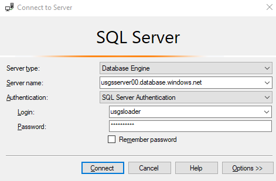
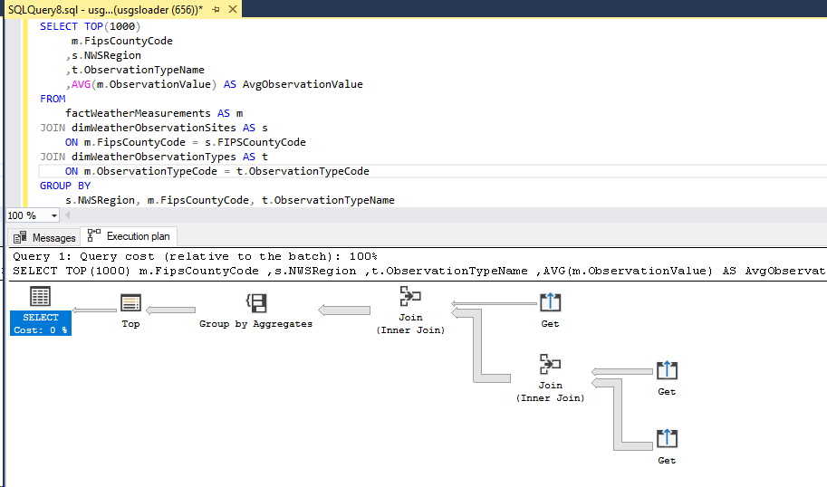
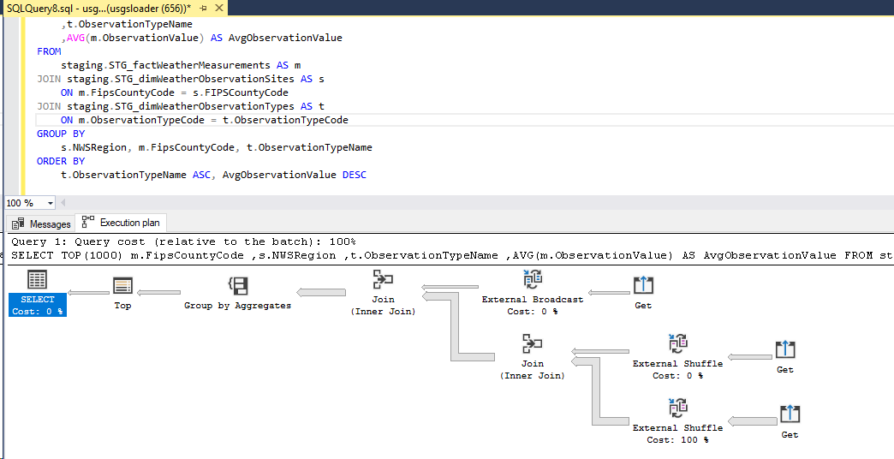

# Module 4: Workload and Query Optimization

## Overview
In this module, you’ll explore some of the performance improvements that have been recently added to SQL Data Warehouse, and how to use the new workload importance feature to ensure predictable performance on your most important workloads.  

## Pre-requisites:
- Existing Azure SQL Data Warehouse
- Azure subscription

If you haven’t run through the earlier modules in the series, launch PowerShell and run the Module4Init.ps1 PowerShell script in the Module 4\Resources folder. This will configure your data warehouse with the pre-requisites needed to complete this lab.

## Load and optimize your staging tables
In the previous module, you loaded data into round-robin staging tables. This table distribution optimizes for loading data into SQL Data Warehouse as fast as possible. But this is not optimal for getting query and analytics performance out of these tables. Consider using alternate distribution methods paired with clustered columnstore indices to make your queries efficient and performant.
The easiest way to do this is by using the ‘Create Table AS Select’ (CTAS) statement to create new tables from your staging tables – this allows you to change the table distribution and also build clustered columnstore indices.  There are a few options for distributing your data warehouse tables: 

- Replicating a table duplicates it across all storage nodes and is best for small dimension tables that will be joined frequently.  
- Hash distributed tables are distributed according to the specified distribution column, and significantly boost performance on joins and aggregations against that column.  When choosing a candidate for a distribution column, look for the column you’ll be joining or aggregating on, and one that has many unique values. For these labs, we’ll use the [FipsCountyCode] column.
- Round robin tables are still a great choice for larger tables where there is no clear distribution key, or where a column distribution could create uneven data skew.

**Optimize staging tables:**
1.	Launch the Object Explorer and connect with the credentials provided below – **making sure to replace ‘##’ with your participant number:**

* **Server name:** usgsserver##.database.windows.net
* **Authentication:** SQL Server Authentication
* **Username:** usgsloader
* **Password:** P@ssword##

    

2.	Run the following script. Once you create the new tables, notice the different icons used for distributed, round robin, and replicated tables. 

    ```sql
    --Weather Data
    --factWeatherMeasurements
    CREATE TABLE [prod].[factWeatherMeasurements]
    WITH
    (
        CLUSTERED COLUMNSTORE INDEX,
        DISTRIBUTION = HASH(fipscountycode)
    )
    AS SELECT *, CONVERT(UNIQUEIDENTIFIER,0x0) AS ELTID FROM [STG].[factWeatherMeasurements]

    --dimWeatherObservationTypes
    CREATE TABLE [prod].[dimWeatherObservationTypes]
    WITH
    (
        CLUSTERED COLUMNSTORE INDEX,
        DISTRIBUTION = REPLICATE
    )
    AS SELECT *, CONVERT(UNIQUEIDENTIFIER,0x0) AS ELTID FROM [STG].[dimWeatherObservationTypes];

    --dimUSFIPSCodes
    CREATE TABLE [prod].[dimUSFIPSCodes]
    WITH
    (
        CLUSTERED COLUMNSTORE INDEX,
        DISTRIBUTION = REPLICATE
    )
    AS SELECT *, CONVERT(UNIQUEIDENTIFIER,0x0) AS ELTID FROM [STG].[dimUSFIPSCodes];

    --dimWeatherObservationSites
    CREATE TABLE [prod].[dimWeatherObservationSites]
    WITH
    (
        CLUSTERED COLUMNSTORE INDEX,
        DISTRIBUTION = REPLICATE
    )
    AS SELECT *, CONVERT(UNIQUEIDENTIFIER,0x0) AS ELTID FROM [STG].[dimWeatherObservationSites];

    /*----fireevents----*/
    ----dimOrganizationCode
    CREATE TABLE [prod].[dimOrganizationCode]
    WITH
    (
        CLUSTERED COLUMNSTORE INDEX,
        DISTRIBUTION = REPLICATE
    )
    AS SELECT *, CONVERT(UNIQUEIDENTIFIER,0x0) AS ELTID FROM [STG].[dimOrganizationCode];
        

    --dimAreaProtectionCategory
    CREATE TABLE [prod].[dimAreaProtectionCategory]
    WITH
    (
        CLUSTERED COLUMNSTORE INDEX,
        DISTRIBUTION = REPLICATE
    )
    AS SELECT *, CONVERT(UNIQUEIDENTIFIER,0x0) AS ELTID FROM [STG].[dimAreaProtectionCategory];

    ```
3.	Now, you will test the performance difference between queries running on external tables vs queries running on distributed tables in SQL Data Warehouse. Before you run the queries below, look at the execution plans by hitting CTRL+L and notice how the hash-distributed and replicated tables create simpler execution plans – this is because these tables help minimize data movement.
    ```sql
    --Multi-join query over hash-distributed and replicated tables
    SELECT  TOP(1000)
        m.FipsCountyCode,
        s.NWSRegion,
        t.ObservationTypeName,
        AVG(m.ObservationValue) AS AvgObservationValue
    FROM	 prod.factWeatherMeasurements AS m
    JOIN 	 prod.dimWeatherObservationSites AS s
        ON m.FipsCountyCode = s.FIPSCountyCode
    JOIN 	 prod.dimWeatherObservationTypes AS t
        ON m.ObservationTypeCode = t.ObservationTypeCode	
    GROUP   BY s.NWSRegion, m.FipsCountyCode, t.ObservationTypeName 
    ORDER   BY t.ObservationTypeName ASC, AvgObservationValue DESC

    ```
    

    ```sql
    --Multi-join query over external staging tables
    SELECT  TOP(1000)
        m.FipsCountyCode,
        s.NWSRegion,
        t.ObservationTypeName,
        AVG(m.ObservationValue) AS AvgObservationValue
    FROM	 ext.factWeatherMeasurements AS m
    JOIN 	 ext.dimWeatherObservationSites AS s
        ON m.FipsCountyCode = s.FIPSCountyCode
    JOIN 	 ext.dimWeatherObservationTypes AS t
        ON m.ObservationTypeCode = t.ObservationTypeCode	
    GROUP   BY s.NWSRegion, m.FipsCountyCode, t.ObservationTypeName 
    ORDER   BY t.ObservationTypeName ASC, AvgObservationValue DESC

    ```
      