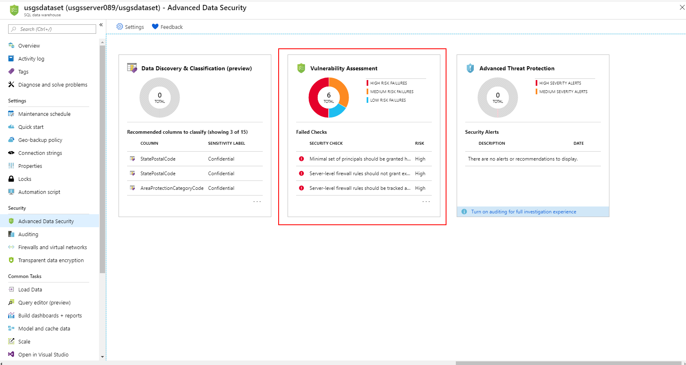
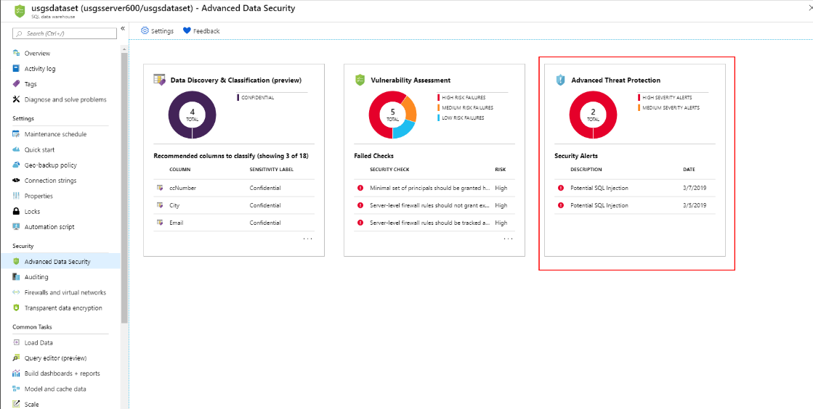
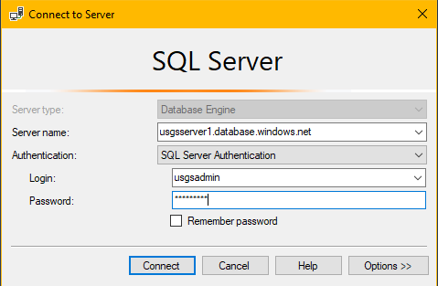

# Module 5: Data privacy and protection

## Overview:
In this module, you learn about the data privacy, security, and recovery features available in Azure SQL Data Warehouse. You will configure these features to prevent unauthorized users/logins from accessing confidential data, to monitor access to confidential columns, to restrict access to specific rows in the data warehouse, and to recover from user/application error in the data warehouse.

## Pre-requisites:
- Azure SQL Data Warehouse
- SQL Server Management Studio
- Azure PowerShell

If you haven’t run through the earlier modules in the series, launch PowerShell and run the Module5Init.ps1 PowerShell script in the Module 5\Resources folder. This will configure your data warehouse with the pre-requisites needed to complete this lab.

## Login to your Azure subscription in PowerShell
The first few sections of this module will use PowerShell to configure settings and values. If you haven’t previously logged into your Azure account, run the following to setup your PowerShell session.

    ```powershell
    # ------- Edit the variables below to set session-wide variables --------- 
    $subscriptionName = '<SubscriptionName>' 
    $participantNumber = <ParticipantNumber> 
    $resourceGroupName = '<ResourceGroupName>'

    # Log into your Azure account
    Connect-AzAccount -Subscription $SubscriptionName

    ```
Run the following to setup the variables you’ll use to configure Azure PowerShell commands in the lab:

    ```powershell
    Import-Module "C:\USGSdata\BruteForceSQL\Invoke-LoginAttack" 

    # ------- Setup module variables ---------
    $serverName = 'usgsserver' + $participantNumber
    $fullyQualifiedServerName = $serverName + '.database.windows.net'
    $dataLakeAccountName = 'usgsdatalake' + $participantNumber
    $blobStorageAccountName = 'usgsstaging' + $participantNumber
    $securityScanResultsContainerName = 'vulnerabilityresults'
    $dataWarehouseName = 'usgsdataset'
    $restorePointLabel = 'preapplicationupgrade_' + (Get-Date -Format FileDateTimeUniversal)
    $restoredWarehouseName = 'usgsdataset_restored'
    $userListLocation = "C:\USGSdata\BruteForceSQL\userList.txt"  
    $passwordListLocation = "C:\USGSdata\BruteForceSQL\passwordList.txt" 
    $dbUserName = 'usgsadmin'
    $dbPassword = 'P@ssword' + $participantNumber
    $securePasswordString = ConvertTo-SecureString $dbPassword -AsPlainText -Force
    $dbCredentials = New-Object System.Management.Automation.PSCredential($dbUserName, $securePasswordString)

    ```
## Create user-defined restore points before an application upgrade
Azure SQL Data Warehouse includes automated database snapshots that can be leveraged to recover or copy a data warehouse to a previous state. These snapshots support an eight-hour recovery point objective (RPO) and are available to be used for 7 days. If you require a faster RPO or you require your snapshot to be available for longer than 7 days, you can manually trigger a snapshot to save the current database state. This is good practice to follow before and after large modifications to your data warehouse - it allows quicker recovery times in the event of any workload interruptions or user errors.

**In your existing PowerShell session**
1.	Create a custom restore point for your data warehouse. Note the creation date and time returned in the output

    ```powershell
    # Creates a custom restore point 
    New-AzSqlDatabaseRestorePoint -ResourceGroupName $resourceGroupName -ServerName $serverName -DatabaseName $dataWarehouseName -RestorePointLabel $restorePointLabel

    ```
2.	Simulate data corruption in the application upgrade process by running the following command to drop a table in the data warehouse

    ```powershell
    # Drop a table in the warehouse to simulate an error in application upgrade
    Invoke-Sqlcmd -Query "DROP TABLE STG.dimAreaProtectionCategory" -ServerInstance $fullyQualifiedServerName -Database $dataWarehouseName -Username $dbCredentials.UserName -Password $dbCredentials.GetNetworkCredential().Password

    ```
3.	Confirm that the table does not exist anymore by running the following command

    ```powershell
    # Select from dropped table
    Invoke-Sqlcmd -Query "SELECT TOP 10 * FROM STG.dimAreaProtectionCategory" -ServerInstance $fullyQualifiedServerName -Database $dataWarehouseName -Username $dbCredentials.UserName -Password $dbCredentials.GetNetworkCredential().Password 

    ```

4.	Restore your data warehouse from the restore point you created earlier by running the commands below. Note: this will take some time to complete.

    ```powershell
    # List the last 10 database restore points
    $restorePointList = ((Get-AzSqlDatabaseRestorePoints -ResourceGroupName $resourceGroupName -ServerName $serverName -DatabaseName ($dataWarehouseName)).RestorePointCreationDate)[-10..-1]

    # Get restore point time
    $targetTime =  $restorePointList | Select-Object -Last 1 


    # Restore data warehouse to a new instance
    $originDatabase = Get-AzSqlDatabase -ResourceGroupName $resourceGroupName -ServerName $serverName -DatabaseName $dataWarehouseName
    $restoredDatabase = Restore-AzSqlDatabase -FromPointInTimeBackup -PointInTime $targetTime -ResourceGroupName $resourceGroupName -ServerName $serverName -TargetDatabaseName $restoredWarehouseName -ResourceId $originDatabase.ResourceID 

    ```
5.	Connect to the restored data warehouse instance and verify that the table exists. You can also login to the Azure portal to see the restored SQL data warehouse instance.

    ```powershell
    # Select from restored data warehouse
    Invoke-Sqlcmd -Query "SELECT TOP 10 * FROM STG.dimAreaProtectionCategory" -ServerInstance $fullyQualifiedServerName -Database $restoredWarehouseName -Username $dbCredentials.UserName -Password $dbCredentials.GetNetworkCredential().Password 

    ```

6.	You can pause or delete the restored data warehouse instance after you have finished exploring it.


## Enable Advanced Threat Protection on your Azure SQL Server
SQL Advanced Threat Protection (ATP) is a unified package for advanced SQL security capabilities in your Azure SQL Server. It includes functionality for discovering and classifying sensitive data, surfacing and mitigating potential database vulnerabilities, and detecting anomalous activities that could indicate a threat to your database. 

**In your existing PowerShell session:**
1.	Turn on data discovery and classification on your Azure SQL Server

    ```powershell
    # Enable advanced threat protection on Azure SQL Server. 
    Note: this feature adds a $15 monthly cost per server to your Azure bill
    Enable-AzSqlServerAdvancedThreatProtection -ResourceGroupName $resourceGroupName -ServerName $serverName

    ```

## Run a security vulnerability assessment on your data warehouse
The Vulnerability Assessment service of the SQL ATP package allow you to discover, track, and fix potential security vulnerabilities in your data warehouse. It uses a knowledge base of rules based on Microsoft’s best practice guidelines and outlines the security issues that are the biggest risks to your data warehouse and its valuable data. In this section, you will run a vulnerability assessment to see what issues you should address.

**In your existing PowerShell session:**
1.	Configure a storage account and container to store assessment results

    ```powershell
    # -- Run a security vulnerability assessment on your data warehouse ---
    # Configure storage account for vulnerability assessment results
    Update-AzSqlDatabaseVulnerabilityAssessmentSettings -ResourceGroupName $resourceGroupName -ServerName $serverName -DatabaseName $dataWarehouseName -StorageAccountName $blobStorageAccountName -ScanResultsContainerName $securityScanResultsContainerName -EmailAdmins $False 

    ```
2.	Run a security scan on the data warehouse. You will notice that there are some outstanding issues to fix on your data warehouse.

    ```powershell
    # Run a security scan on the data warehouse
    $scanLabel = 'usgsdw-initialscan'
    Start-AzSqlDatabaseVulnerabilityAssessmentScan -ResourceGroupName $resourceGroupName -ServerName $serverName -DatabaseName $dataWarehouseName -ScanId $scanLabel 

    ```
3.	Login to the Azure portal and navigate to your data warehouse. In the ‘Advanced Data Security’ pane underneath the security header, you will see the results of the Vulnerability assessment scan. Click into the ‘Vulnerability Assessment’ tile to get more details, remediation steps, and to set a baseline for the next security scan.

    

## Configure threat detection capabilities for your data warehouse
The threat detection capabilities of the SQL ATP package allow you to monitor and alert on anomalous activities on your data warehouse. The activities could range from a potential SQL injection attack, a brute force password attack, or even login from an unfamiliar SQL Server principal. In this section, you will launch a brute force password attack on your data warehouse to test the threat detection capabilities of the ATP package.

**In your existing PowerShell session**
1.	Configure threat detection for your data warehouse. Below you create policies for the entire server, so any new databases or data warehouses created inherit this configuration. Modify the ‘NotificationRecipientsEmail’ parameter below with your email address if you would like to receive an email for detected threats. 

    ```powershell
    # Set an auditing policy on the warehouse. This is required to use threat detection capabilities
    Set-AzSqlServerAuditing -State Enabled -ResourceGroupName $resourceGroupName -ServerName $serverName -StorageAccountName $blobStorageAccountName

    # Set a threat detection policy. This can be configured to email the admins who manage the data warehouse
    Set-AzSqlServerThreatDetectionPolicy -ResourceGroupName $resourceGroupName -ServerName $serverName -StorageAccountName $blobStorageAccountName -EmailAdmins $False -NotificationRecipientsEmail "admin@example.com"

    ```
2.	Run a brute force password attack against your data warehouse. 

    ```powershell
    # Run brute force login script to test threat detection policy
    Invoke-LoginAttack -ComputerName $fullyQualifiedServerName -UserList $userListLocation -PasswordList $passwordListLocation -Service SQL -Verbose  

    ```
3.	Run a SQL injection against your data warehouse. 

    ```powershell
    # Run simple SQL injection attack against table in DW
    $searchInput = "06031' OR 1=1--"
    Invoke-Sqlcmd -Query "SELECT TOP 500 * FROM prod.factWeatherMeasurements WHERE fipscountyCode = $fipsCounty OR ObservationTypeCode LIKE '%$searchInput%' OR StationId LIKE '%$searchInput%' OR ObservationSourceFlag LIKE '%$searchInput%'" -ServerInstance $fullyQualifiedServerName -Database $dataWarehouseName -Username $dbUserName -Password $dbPassword

    ```
4.	Login to the Azure portal and navigate to your data warehouse. In the ‘Advanced Threat Protection’ pane underneath the security header, you will see the security alerts generated from the brute force password attack. It can take up to 10 minutes for the alert to show up in the portal.

    

## Connect to your data warehouse in SQL Server Management Studio
The rest of this module will use T-SQL code to configure data privacy for columns in your data warehouse. Follow the steps below to login to your data warehouse

1.	Launch the Object Explorer and connect to your sample data warehouse with the credentials provided below – **making sure to replace ‘##’ with your participant number:**
* **Server name:** usgsserver##.database.windows.net
* **Authentication:** SQL Server Authentication
* **Username:** usgsadmin
* **Password:** P@ssword##

    