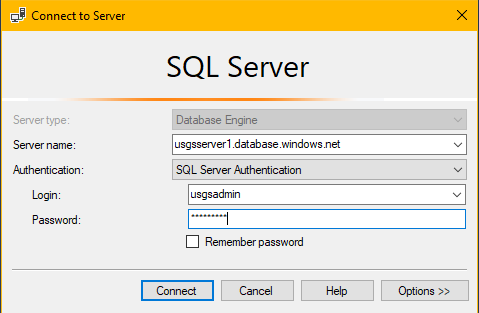

# Module 6: Performance monitoring and troubleshooting

## Overiew
In this module, you learn about the workflow for troubleshooting query and loading performance issues with your SQL Data Warehouse. You will use advisors and performance recommendations in the Azure portal, in addition to Dynamic Management Views (DMVs) and Azure Data Studio dashboards to diagnose and monitor issues occurring in your data warehouse.

Troubleshooting SQL DW performance issues can be like hunting for a needle in a haystack. Often performance issues are symptoms of other larger problems lurking beneath the fold. The key to a successful troubleshooting session is to start by understanding the state of the overall data warehouse. Insights gleaned from here can help inform which areas require deeper dives and further performance tuning.

## Pre-requisites:
- Azure SQL Data Warehouse
- SQL Server Management Studio
- Azure Data Studio
- Azure subscription
If you haven’t run through the earlier modules in the series, launch PowerShell and run the Module6Init.ps1 PowerShell script in the Module 6\Resources folder. This will configure your data warehouse with the pre-requisites needed to complete this lab.

## Resource monitoring using the Azure portal:
Azure SQL Data Warehouse provides a rich monitoring experience within the Azure portal that is useful for surfacing performance insights. Furthermore, data emitted in the Azure portal can be integrated with Azure Log Analytics and Azure Monitor to provide a holistic monitoring experience for your entire Azure analytics platform.

**In a web browser session:**
1.	Login to the [Azure Portal](http://portal.azure.com/)
2.	Navigate to your SQL Data Warehouse (‘usgsdataset’)

    

3.	Click on the ‘DWU Usage’ chart to launch the Azure Monitor portal experience. 
    

4.	Click on the ‘Add metric’ button and a metric for ‘CPU percentage (Avg)’. Add another metric for ‘Data IO percentage (Avg’) as well. You can repeat this process to add more metrics to the chart to help you get an overview of the system state.
    

5.	Click the ‘Last 24 hours (Automatic)’ button and change the time range of observation from the last 24 hours, to the last hour. Observe how the time ranges displayed in the chart have now been modified to the last hour.
    

6.	You can pin the metrics you just configured to an Azure dashboard for easy straightforward monitoring next time around. Click the ‘Pin to dashboard’ button and select ‘Pin to current dashboard’
    

     

## Resource monitoring and insights using Azure Data Studio:
Azure Data Studio is a cross-platform tool for monitoring and managing various data platforms including SQL Data Warehouse. The Azure SQL Data Warehouse Insights extension for Azure Data Studio features a performance dashboard that monitors, and surfaces insights and recommendations for tuning your data warehouse. The queries that power the Data Warehouse Insights dashboard are also used to surface DW recommendations in the Azure Advisor.

1.	Launch Azure Data Studio and connect to your SQL Data Warehouse using credentials below – **making sure to replace ‘##’ with your participant number:**
* **Server name:** usgsserver##.database.windows.net
* **Authentication:** SQL Server Authentication
* **Username:** usgsadmin
* **Password:** P@ssword##

    


2.	Install the Azure SQL Data Warehouse Insights extension. First, click the ‘Extensions’ icon, then search for ‘insights’ in the marketplace menu. Click install, and then ‘reload’ after the extension is finished installing.  
    

3.	Expand the ‘Databases’ node, and right-click on the ‘usgsdataset’ database. Click ‘Manage’ on the right-click menu to get to the overview page for your DW.  
    

4.	Click on the ‘SQL DW dashboard’ tab to view the performance reports already pre-configured for your warehouse. You should see reports on Data Skew, outdated statistics, data distribution, and backup times. Note: some charts may be empty if there are no results to display.
    

5.	Observe the data distribution report. This shows the data size stored in each of SQL DW’s 60 distributions. This chart allows you to detect whether your data warehouse is suffering from physical data skew which can impact query performance. What can you infer from this report?

6.	Observe the data skew report. This shows any tables that have abnormally large data skews. This is one of the most common causes of performance issues in a SQL DW system. What can you infer from this report?

7.	You can additionally query for insights based on system resource usage directly in Azure Data Studio. Navigate to the [SQL DW monitoring docs page](https://docs.microsoft.com/en-us/azure/sql-data-warehouse/sql-data-warehouse-manage-monitor), and select a few SQL queries to run. To run a new query on your DW, right-click the DW, and select ‘New Query’. What insights can you learn about the memory or CPU consumption of nodes in your data warehouse?


## Troubleshooting a query performance issue:
In this section, you will use Dynamic Management Views (DMVs) to investigate a slow performing query and investigate the reasons why it is not performant. 

**In SQL Server Management Studio (SSMS):**
1.	Login to your data warehouse using the admin credentials below – **making sure to replace ‘##’ with your participant number:**
* **Server name:** usgsserver##.database.windows.net
* **Authentication:** SQL Server Authentication
* **Username:** usgsadmin
* **Password:** P@ssword##

    

2.	Open the ‘WeatherMonitor_slow’ SQL file located in the Module 6\Resources folder. Press ‘Ctrl+L’ to display the execution plan that will be run for this query. What step is estimated to take the longest time?

3.	Click on ‘Execute’ to run the query
    

4.	Open a new query window and run the following query to monitor the query execution. The query uses the [‘sys.dm_pdw_exec_requests’](https://docs.microsoft.com/en-us/sql/relational-databases/system-dynamic-management-views/sys-dm-pdw-exec-requests-transact-sql?view=azure-sqldw-latest) DMV which uniquely identifies the last 10,000 queries executed on a SQL DW. What resource class is your query running under?
    ```sql
    --- Monitor query execution
    SELECT	* FROM   sys.dm_pdw_exec_requests
    WHERE	[label] = 'WeatherMonitorSlow' AND resource_class IS NOT NULL
    ```

5.	Use the Request ID from the previous query to replace the value in the ‘request_id’ column below and retrieve the distributed SQL (DSQL) plan for your query. The query uses the [‘sys.dm_pdw_requests_steps’](https://docs.microsoft.com/en-us/sql/relational-databases/system-dynamic-management-views/sys-dm-pdw-request-steps-transact-sql?view=azure-sqldw-latest) DMV which holds information about all the operations that compose a given query. Wait until query execution is complete. What operation took the longest time to execute? Why?
```sql
--- Find distributed query plan for single query
SELECT	* FROM sys.dm_pdw_request_steps
WHERE	request_id = 'QID####'
ORDER BY step_index;
```

6.	Copy the ‘request_id’ and ‘step_index’ with the highest elapsed time into the query below. This will show additional execution information for the longest query step. The query uses the [‘sys.dm_pdw_sql_requests’](https://docs.microsoft.com/en-us/sql/relational-databases/system-dynamic-management-views/sys-dm-pdw-sql-requests-transact-sql?view=azure-sqldw-latest) DMV which holds information about the query distributions to the different SQL DW nodes. What additional insights can you glean from the amount of time spent executing on each distribution?
```sql
--- Find distributed query plan for single query
SELECT	* FROM sys.dm_pdw_sql_requests
WHERE	request_id = 'QID####' AND step_index = <step_index>;
```

7.	Use the same ‘request_id’ and ‘step_index’ values from the previous query below. This query shows additional information about the data movement in your query. This query uses the [‘sys.dm_pdw_dms_workers’](https://docs.microsoft.com/en-us/sql/relational-databases/system-dynamic-management-views/sys-dm-pdw-dms-workers-transact-sql?view=azure-sqldw-latest) DMV which holds information about all the SQL DW workers completing data movement steps. What can you do to eliminate the data movement step from this query?
```sql
--- Find data movement information for single query
SELECT	* FROM sys.dm_pdw_dms_workers
WHERE	request_id = 'QID####' AND step_index = <step_index>;
```

8.	In a new query window, open the ‘WeatherMonitor_fast’ SQL file located in the Module 6\Resources folder. Press ‘Ctrl+L’ to display the execution plan that will be run for this query. What differences do you notice between this execution plan and the one for the ‘WeatherMonitor_slow’ SQL file?


## Common query performance issues and mitigations:
1.	Poor or missing statistics:
The more Azure SQL DW knows about your data, the faster it can execute queries against it. Enable the automatic creation of statistics if it is disabled on your DW.
Mitigation: Re-build statistics and update them after each new data load to your data warehouse. Focus on columns participating in JOIN, GROUP BY, ORDER BY, and DISTINCT clauses.

2.	Data skew between distributions:
This causes few distributions to bear the load of most queries. Data skew can happen in DW tables, and in temp tables as well
Mitigation: Change the distribution schema. Is the table hash-distributed? On which key? Is it possible to use round-robin distributed tables?

3.	Poor columnstore index quality:
Having high segment quality is critical to achieving optimal query performance on columnstore tables. The quality of a data segment is most optimal when there are at least 100K rows per compressed row group. Less optimal segments can cause memory limitation issues and performance degradation
Mitigation: Rebuild indexes and reload data using higher resource classes

4.	Concurrency limitations
Queries are queued and starved for resources.
Mitigation: Create appropriate workload classifiers that either increase or decrease resource class of queries depending on memory and concurrency needs.
