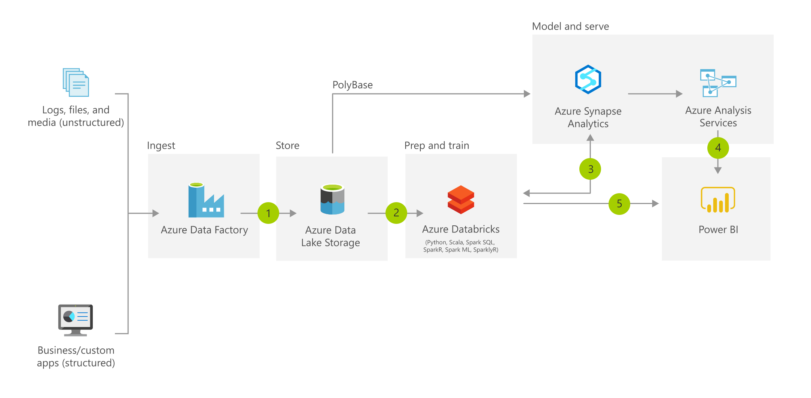

# Azure Modern Data Warehouse Scripts Workshop

This workshop is about how to leverage ARM template and Powershell scripts to provision an Azure [Mondern Data Warehouse](https://azure.microsoft.com/en-in/solutions/architecture/modern-data-warehouse/) solution. 

The goals of this workshop is to provide a set of reusable scripts to quickly provision a sample end to end solution following the reference architecture discussed above. So different people could benefit from different perspectives:

- The beginner could learn the different services by looking at a near real world project.
- The UI person could mapping all the operations they tend to drag & draw to Powershell scripts.
- The DevOps guys could borrow the scripts here to build CD/CI pipeline for the data project. We will further improve this workshop, hopefully could show a workable sample.
- The tech sales could quickly demonstrate the different features of the services through a workable solution. A workable demo is worth much more than thousands of words in PPT and document. Specifically, the solution could be played by any tech audience at any time.
- For the advanced tech folks, it save a lot of efforts to rebuild the fundamental codes when they want to deep dive other topics. For example, you may want to compare the pros and cons between Azure Data Factory (Data Flow), Azure Databricks and Synapse MPP database engine.

# Target Audience
- Data Architects
- Data Engineers

# Modules Overview

## Lab Provision: [Provision the cloud servcies and VM required for this workshop](LabProvision/readme.md)

## Module 0: [Install Lab Pre-requisites](Module%200/README.md)
In this module, you will initialize your SQL Data Warehouse with SQL users and logins and restore the sample fire events database you will be working with in later modules.

## Module 1: [Land raw data in Azure Data Lake Store (Gen2)](Module%201/README.md)
In this module, you learn how to copy data from on-prem sources to Azure. You will use Azure Data Factory to create a pipeline that copies CSV data and data from an on-prem SQL Server instance to Azure Data Lake Store Gen2.

## Module 2: [Restrict access to data in Azure](Module%202/README.md)
In this module, you learn how to restrict access to your data both from external public endpoints, but also other services internal to Azure. You will use PowerShell to configure virtual network service endpoints for your Azure SQL Data Warehouse and Data Lake Storage account.

## Module 3: [SQL Data Warehouse Ingestion](Module%203/README.md)
In this module, you will learn about the different methods you can use to load data into your SQL Data Warehouse.  First, you’ll use Polybase to query external data in Azure Data Lake Store Gen2. Then, you’ll use the ‘CREATE TABLE AS SELECT’ (CTAS) statement to load this external data into internal SQL DW tables. You’ll also explore loading best practices, including the use of staging tables for max loading performance. 

## Module 4: [Workload and Query Optimization](Module%204/README.md)
In this module, you’ll explore some of the performance improvements that have been recently added to SQL Data Warehouse, and how to use the new workload importance feature to ensure predictable performance on your most important workloads.  

## Module 5: [Data privacy and protection](Module%205/README.md)
In this module, you learn about the data privacy, security, and recovery features available in Azure SQL Data Warehouse. You will configure these features to prevent unauthorized users/logins from accessing confidential data, to monitor access to confidential columns, to restrict access to specific rows in the data warehouse, and to recover from user/application error in the data warehouse.

## Module 6: [Performance monitoring and troubleshooting](Module%206/README.md)
In this module, you learn about the workflow for troubleshooting query and loading performance issues with your SQL Data Warehouse. You will use advisors and performance recommendations in the Azure portal, in addition to Dynamic Management Views (DMVs) and Azure Data Studio dashboards to diagnose and monitor issues occurring in your data warehouse.

Troubleshooting SQL DW performance issues can be like hunting for a needle in a haystack. Often performance issues are symptoms of other larger problems lurking beneath the fold. The key to a successful troubleshooting session is to start by understanding the state of the overall data warehouse. Insights gleaned from here can help inform which areas require deeper dives and further performance tuning.